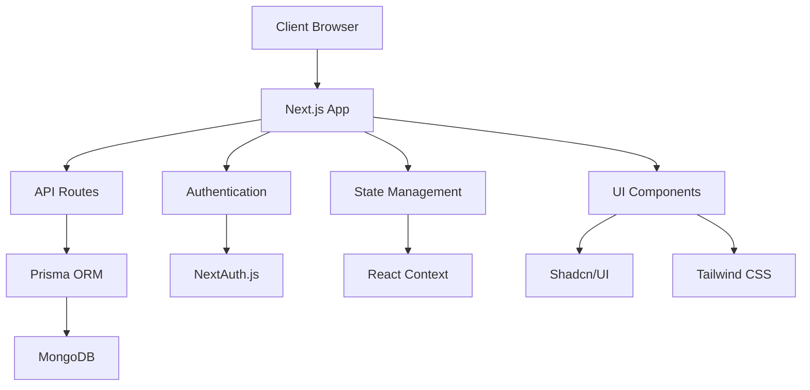

# Inventory Management System Documentation

## Table of Contents

1. [Application Overview](#application-overview)
2. [Tech Stack](#tech-stack)
3. [Project Structure](#project-structure)
4. [Core Components & Modules](#core-components--modules)
5. [Data Flow & State Management](#data-flow--state-management)
6. [Database Schema](#database-schema)
7. [Authentication Flow](#authentication-flow)
8. [API Documentation](#api-documentation)
9. [Testing Strategy](#testing-strategy)
10. [Deployment & CI/CD](#deployment--cicd)
11. [Performance Optimizations](#performance-optimizations)
12. [Development Guidelines](#development-guidelines)

## Application Overview

### Purpose and Core Functionality

This is a comprehensive inventory management system built with Next.js that enables businesses to:

- Track product inventory with variant support
- Manage stock levels and buffer stock
- Handle customer and vendor relationships
- Process transactions and returns
- Generate reports and analytics
- Manage multiple warehouses
- Track product categories and units

### Key Features

- Multi-user authentication system
- Product variant management
- Real-time stock tracking
- Transaction history
- Customer and vendor management
- Warehouse management
- Product categorization
- Return management system
- Image management for products
- Telegram bot integration for notifications

### Architectural Diagram



## Tech Stack

### Frontend

- **Framework**: Next.js 15.1.0
- **UI Library**:
  - Shadcn/UI (Radix UI primitives)
  - Tailwind CSS
  - Framer Motion for animations
- **State Management**: React Context API
- **Form Handling**: React Hook Form with Zod validation
- **Data Fetching**: Next.js built-in data fetching
- **Charts**: Recharts
- **Notifications**: Sonner

### Backend

- **Runtime**: Node.js
- **Database**: MongoDB
- **ORM**: Prisma 6.0.1
- **Authentication**: NextAuth.js 5.0.0-beta.25
- **API**: Next.js API Routes
- **Validation**: Zod
- **Notifications**: Node Telegram Bot API

### Development Tools

- **Language**: TypeScript
- **Linting**: ESLint
- **Styling**: Tailwind CSS
- **PWA Support**: @ducanh2912/next-pwa

## Project Structure

```
src/
├── app/                 # Next.js app directory (routing)
├── components/          # Reusable UI components
├── lib/                 # Utility libraries and configurations
├── utils/              # Helper functions
├── types/              # TypeScript type definitions
├── hooks/              # Custom React hooks
├── middleware.ts       # Next.js middleware
└── prisma.ts          # Prisma client configuration
```

## Core Components & Modules

### Database Schema

#### Key Models

1. **User**

   - Authentication and user management
   - Role-based access control
   - Profile management

2. **Product**

   - Core product information
   - Stock management
   - Variant support
   - Category and warehouse relationships

3. **Transaction**

   - Stock movement tracking
   - Action types (CREATED, DELETED, INCREASED, RETURNED, DECREASED)
   - User and customer/vendor associations

4. **Customer & Vendor**

   - Company information
   - Contact details
   - Transaction history

5. **Warehouse & Category**
   - Location management
   - Product categorization
   - Stock distribution

### Authentication Flow

- NextAuth.js implementation
- Session-based authentication
- Protected routes via middleware
- Role-based access control

### API Structure

- RESTful API endpoints
- Type-safe API routes
- Error handling middleware
- Rate limiting implementation

## Data Flow & State Management

### Data Fetching Patterns

- Server-side rendering (SSR) for critical data
- Static site generation (SSG) for static content
- Client-side data fetching for dynamic content

### State Management

- React Context for global state
- Local state for component-specific data
- Form state management with React Hook Form

## Performance Optimizations

### Implemented Optimizations

- Code splitting via Next.js
- Image optimization
- PWA support
- Caching strategies
- Lazy loading of components

### Bundle Optimization

- Tree shaking
- Dynamic imports
- Route-based code splitting

## Development Guidelines

### Code Style

- TypeScript strict mode
- ESLint configuration
- Prettier formatting
- Component-based architecture

### Git Workflow

- Feature branch workflow
- Pull request reviews
- Semantic versioning

### Testing Strategy

- Unit testing with Jest
- Integration testing
- E2E testing with Playwright

## Deployment

### Environment Setup

- Environment variables management
- Database configuration
- API key management

### Build Process

- Next.js build optimization
- Static file generation
- API route compilation

### Deployment Pipeline

- Vercel deployment
- Environment variable configuration
- Database migration handling

## Security Measures

### Implemented Security Features

- Authentication middleware
- API route protection
- Input validation
- XSS protection
- CSRF protection

### Data Protection

- Password hashing with bcrypt
- Secure session management
- API rate limiting
- Input sanitization

## Monitoring and Maintenance

### Error Tracking

- Error boundary implementation
- Logging system
- Performance monitoring

### Maintenance Tasks

- Database optimization
- Cache management
- Security updates
- Dependency updates

---

This documentation is a living document and should be updated as the application evolves. For specific implementation details, refer to the inline code comments and type definitions.
